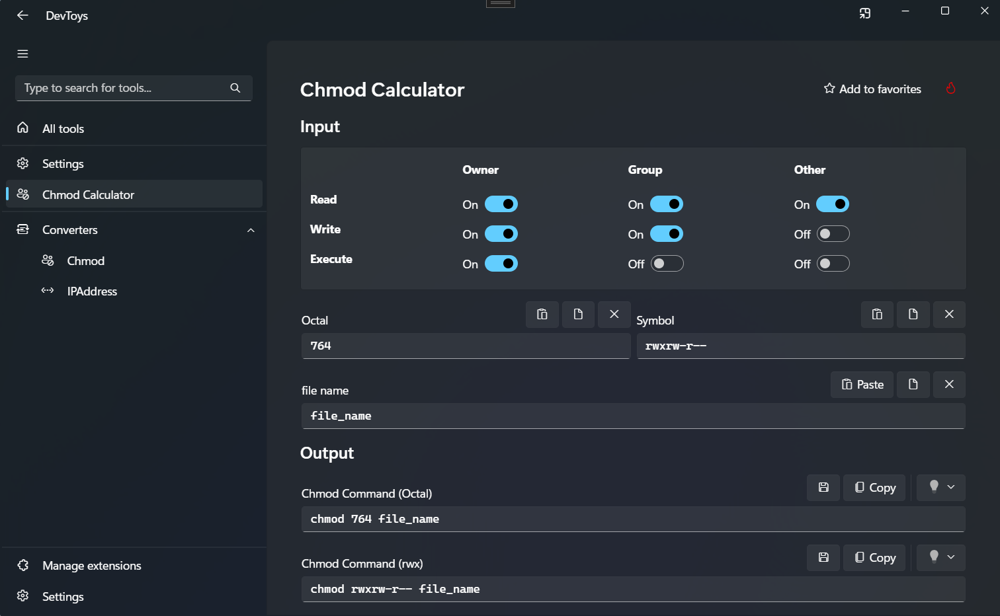

# DevToys.ExtensionKit

This package is an extension for [DevToys 2.0](https://devtoys.app/).

DevToys.ExtensionKit provides additional developer tools for the DevToys application.

## Features

This extension offers the following tools:

### Converter Tools

- **IP Address Parser**: Analyze IP addresses and subnets to get network information, including subnet masks, CIDR notation, usable host ranges, and more.
- **Chmod Calculator**: Calculate and convert Unix file permissions between symbolic notation (rwxr-xr--) and octal notation (754), and generate chmod commands.

## Installation

1. Download the `DevToys.ExtensionKit` NuGet package from [NuGet.org](https://www.nuget.org/packages/DevToys.ExtensionKit).
2. In DevToys, open "Manage Extensions", click "Install" and select the downloaded NuGet package.
3. After installation, restart DevToys.
4. Verify that new tools have been added to the toolbar.

## Issues and Feedback
Issues and feedback are welcome in the [Issues section of the GitHub repository](https://github.com/yui10/DevToys.ExtensionKit/issues).

Pull requests are also welcome.

## Release Notes
[1.0.1]
- Bug fixes
- Updated documentation

[1.0.0]
- Initial release
- Added IP Address Parser tool
- Added Chmod Calculator tool

## License

This project is licensed under the terms found in the LICENSE file in the root of this repository.